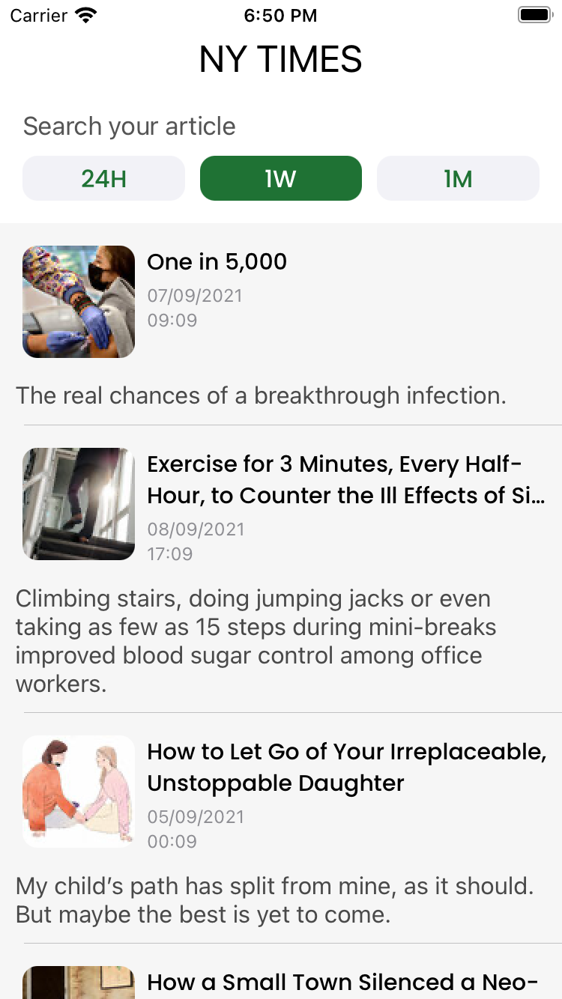

# Most-Popular-NYT-Articles
iOS app written in swift to view the Most Popular NEW York times  Articles ! 

# ItunesSearcher

  
  
   

### Installation

1. Clone or download the project to your local machine
2. Open the project in Xcode
3. Run the simulator

      

